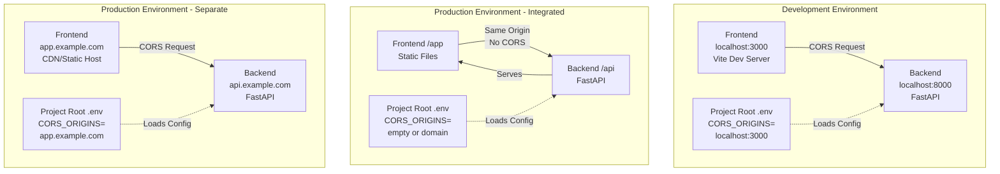
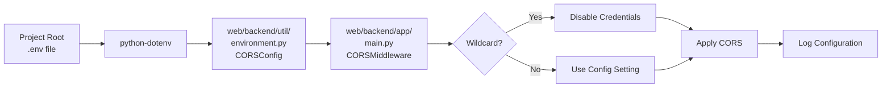
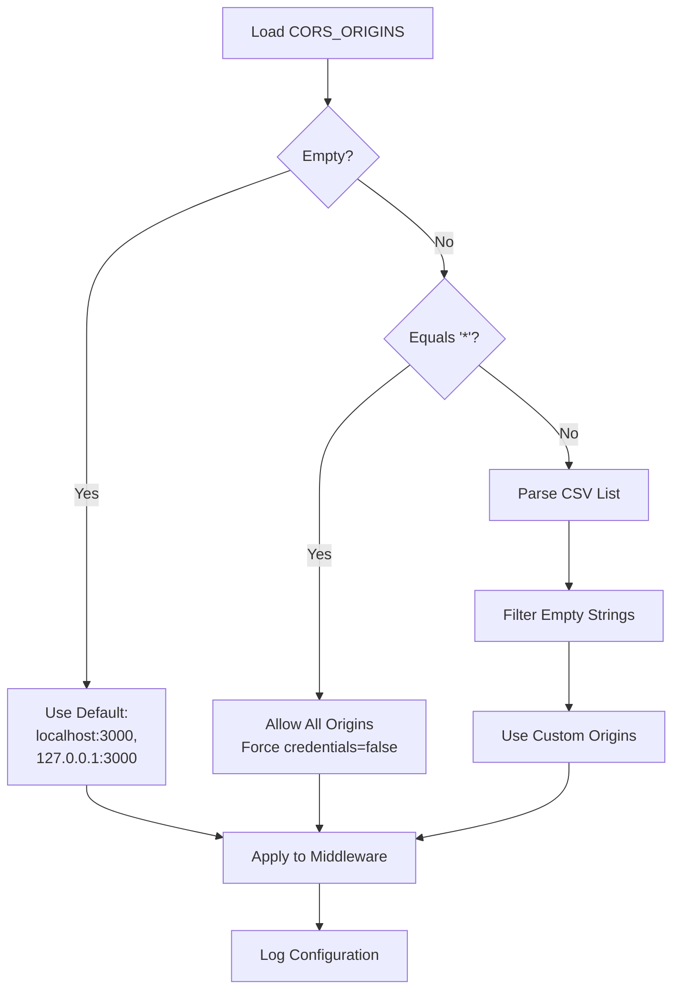

# CORS Configuration Architecture

## System Overview



## Configuration Flow



## Origin Validation Logic



## File Structure

```
wp-embeddings/              # Project root
├── .env                    # Local config - git ignored
│   └── CORS_ORIGINS=http://localhost:3000
├── env-example             # UPDATED - Template with CORS docs
│   └── CORS_ORIGINS=http://localhost:3000,http://127.0.0.1:3000
├── dataprep/               # Shares .env file
└── web/backend/
    ├── app/
    │   └── main.py         # UPDATED - Uses environment config
    │       └── Config.cors.get_origins()
    ├── util/
    │   ├── __init__.py     # Existing
    │   ├── languages.py    # Existing
    │   └── environment.py  # NEW - Environment config management
    │       └── Loads .env from project root
    └── pyproject.toml      # UPDATED - Add python-dotenv
```
